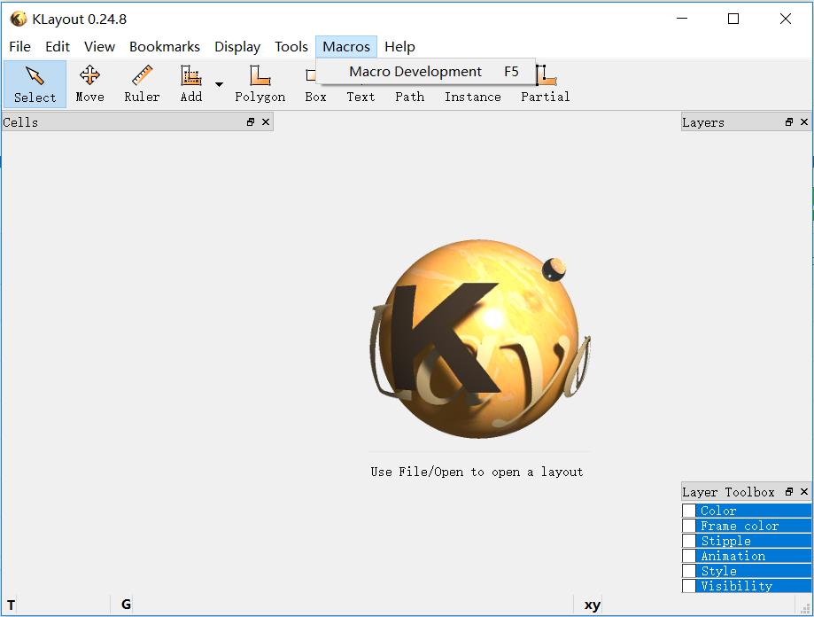
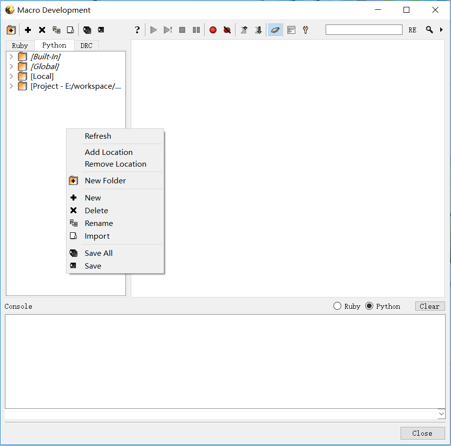

# sqc-painter 说明文档

Superconducting Quantum Chip Painter

超导量子计算芯片画图程序

[项目地址](https://github.com/zhaouv/sqc-painter) | [下载](https://github.com/zhaouv/sqc-painter)

基于[KLayout](https://github.com/klayoutmatthias/klayout) (version:[klayout-0.26.1-win64](https://www.klayout.org/downloads/Windows/klayout-0.26.1-win64.zip)) 中Python3.7.3的脚本环境, 写了库paintlib用于超导芯片的绘图

## 环境配置以及运行

将KLayout解压至**不包含中文**的路径, 运行klayout_app.exe, 如图所示, 点击Macros/Macro Development



弹出的窗口中, 先点击左上的Python, 选中Python的环境, 在下方右键Add Location, 选中sqc-painter的路径添加到环境中



双击demos/featureList.py, 点击右侧上方的, 验证功能正常

运行脚本时, 在左侧双击该脚本, 之后点击运行

## 通过命令行使用

通过命令行使用可以更加灵活的与其他工具或脚本集成

将`<sqc-painter path>`和`<klayout path>`替换为正确路径

```
@cd /d "<sqc-painter path>"
"<klayout path>\klayout_app.exe" -r demos/featureList.py
"<klayout path>\klayout_app.exe" -r demos/featureList.py
```
需要运行两次是因为demos/featureList.py用到了TBD来处理待定数值

- - -

- **Start Page**  
- [脚本绘图基础](base.md)  
- [绘制库的建立和使用](drawlib.md)  
- [demo](demo.md)  