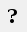

# 脚本绘图基础

KLayout提供了库pya作为python绘图的API, spc-painter用paintlib进行了部分封装, 仍需对pya有一定了解

### pya和paintlib

pya是KLayout提供的绘图接口,在脚本界面点击可以打开其帮助文档

paintlib中提供了:
+ BasicPainter : 用于画基础图形的静态类
+ Painter : 画图工具的基类
+ LinePainter : 用来画线的工具
+ CavityBrush : 腔的画笔
+ CavityPainter : 用来画腔的工具
+ PcellPainter : 用来画文字的工具
+ TransfilePainter : 用来导入已有gds的工具
+ IO : 处理输入输出的静态类

### 浮点数与整数

pya中涉及到具体图形的class分成了两大类:
+ 名字以D开头的`DPoint,DEdge,DPolygon,DCplxTrans`等,以浮点数的形式运算和储存图形
+ `Point,Edge,Polygon,Region,CplxTrans`等,以整数的形式运算和储存图形

为了保证生成gds的精度,在绘图过程中,以浮点数的形式进行运算,直到把图形画出的最后时刻,再转换成整数来储存  
把图形放置到cell中时,或者利用Region进行减法运算时,也需要转成整数的形式

### layout, cell和layer

KLayout中,一个gds文件对应一个Layout,其中的图形需要放置在cell和layer中  
通过`layout,top = paintlib.IO.Start("guiopen")`获取layout以及最外层的cell  

### 用到的class及其方法

- - -

- [Start Page](README.md)  
- **脚本绘图基础**  
- [b](b.md)  
