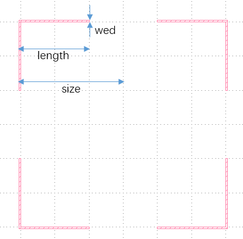
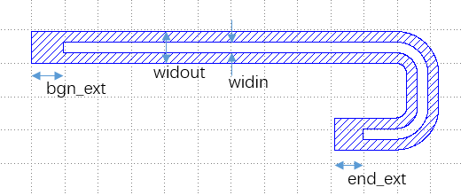

# 脚本绘图基础

KLayout提供了库pya作为python绘图的API, spc-painter用paintlib进行了部分封装, 仍需对pya有一定了解

## pya和paintlib

**pya** 是KLayout提供的绘图接口,在脚本界面点击可以打开其帮助文档

**paintlib** 中提供了:
+ BasicPainter : 用于画基础图形的静态类
+ Painter : 画图工具的基类
+ LinePainter : 用来画线的工具
+ CavityBrush : 腔的画笔
+ CavityPainter : 用来画腔的工具
+ PcellPainter : 用来画文字的工具
+ TransfilePainter : 用来导入已有gds的工具
+ IO : 处理输入输出的静态类

## layout, cell和layer

KLayout中,一个gds文件对应一个Layout,其中的图形放置在cell构成的树结构中  
每个图形自身有layer属性  

+ `layout,top = paintlib.IO.Start("guiopen")` 获取Layout以及最外层的cell  
+ `cell1 = layout.create_cell("Cavity1")` 创建cell
+ `layer1 = layout.layer(10, 15)` 创建layer

`layout.dbu = 0.001`设置单位长度为1nm

`top.insert(pya.CellInstArray(cell1.cell_index(),pya.Trans()))` 把cell插入到另一个cell中

## 作图精度

`layout.dbu = 0.001` 设置单位长度为1nm

`paintlib.IO.pointdistance=500` 设置腔的精度,转弯处相邻两点的距离不会超过500nm

**整数与浮点数** :

pya中涉及到具体图形的class分成了两大类:
+ 名字以D开头的`DPoint,DEdge,DPolygon,DCplxTrans`等,以浮点数的形式运算和储存图形
+ `Point,Edge,Polygon,Region,CplxTrans`等,以整数的形式运算和储存图形

为了保证生成gds的精度,在绘图过程中,以浮点数的形式进行运算,直到把图形画出的最后时刻,再转换成整数来储存  
把图形放置到cell中时,或者利用Region进行减法运算时,也需要转成整数的形式

## pya中部分class及其方法

### DPoint  
基础图形:点,用来构成有面积的图形  
+ 构造`pt=pya.Dpoint(134000,-3000)`创建新点  
+ 成员`pt.x`  
+ 成员`pt.y`  
+ 方法`pt.distance(pt2)`获得两点间距离  

### DEdge  
基础图形:边,主要用来描述和计算  
+ 构造`edge=pya.DEdge(134000,-3000,135000,-4000)`用(x1,y1,x2,y2)的形式创建新边  
+ 构造`edge=pya.DEdge(pt1,pt2)`用两个点创建新边  
+ 方法`edge.transformed(tr:pya.DCplxTrans)`使用给定的转换产生一个新边(原边不变)  
+ 方法`edge.length()`获得边的长度  
+ 成员`edge.p1`  
+ 成员`edge.p2`  

### DPolygon  
图形实体:多边形,构成有面积的图形实体  
+ 构造`polygon=pya.DPolygon(pts:list)`用点的列表创建新多边形  
+ 方法`polygon.transformed(tr:pya.DCplxTrans)`使用给定的转换产生一个新多边形(原多边形不变)  
+ 方法`polygon.transform(tr:pya.DCplxTrans)`把给定的转换作用到多边形上(返回改变后的多边形)  

### DCplxTrans  
图形转换:转换,描述一个图形到另一个图形的平移,旋转,缩放等转换  
+ 构造`tr=pya.DCplxTrans(1,90,false,133000,-2000)`用(放大倍数,旋转角度,是否先沿x翻转,平移x,平移y)创建新转换  

### Region  
图形实体:区域,整数形式的图形集合  
+ 构造`region=pya.Region(polygons:list)`用整数多边形的列表创建新区域  
整数多边形用`pya.Polygon.from_dpoly(x:pya.polygon)`产生  
+ 方法`region=region1-region2`产生两个区域的差作为新区域  
+ 方法`region=region1+region2`产生两个区域的和作为新区域  

## paintlib中部分class及其方法

### BasicPainter  
用于画基础图形的静态类,不需要产生实例,以`paintlib.BasicPainter.func()`的形式直接执行其方法  
+ 方法`Border(leng=3050000,siz=3050000,wed=50000)`  
产生给定尺寸的边界,返回一个pya.Region  

+ 方法`Electrode(x,y,angle,widout=20000,widin=10000,` `wid=368000,length=360000,midwid=200000,midlength=200000,narrowlength=120000)`  
产生给定尺寸的电极,返回一个pya.DPolygon  
+ 方法`Electrode(brush:paintlib.CavityBrush,` `wid=368000,length=360000,midwid=200000,midlength=200000,narrowlength=120000)`  
产生给定尺寸的电极,返回一个pya.DPolygon  
+ 方法`Connection(x,y=0,angle=0,mod=48)`  
产生给定尺寸的与Qubit的连接,mod取48或8表示连线的外部宽度  
+ 方法`Connection(brush:paintlib.CavityBrush)`,返回一个pya.DPolygon  
产生给定尺寸的与Qubit的连接,brush.widout需要是48或8表示连线的外部宽度  
+ 方法`Draw(cell,layer,x)`,返回一个pya.DPolygon  
把给定的图形x画到指定的cell和layer中  
x可以是pya.DPolygon或pya.Region或pya.Polygon  

### LinePainter  
用来画线的类,作为CavityPainter成员使用,两个LinePainter分别画内径外径,相减后得到腔  
+ 方法`Straight(length)`  
沿着当前方向直走length,并返回走过的长度  
+ 方法`Turning(radius,angle=90)`  
沿着当前方向,以radius为半径转向走angle角度,并返回走过的长度  
radius为正时是右转,为负时是左转  

### CavityBrush  
腔的画笔,用来描述腔起始,终点,与其他图形拼接位置的类  
+ 构造`brush=paintlib.CavityBrush(pointc=pya.DPoint(0,0),` `angle=0,widout=20000,widin=0,bgn_ext=0)`  
+ 构造`brush=paintlib.CavityBrush(edgeout=pya.DEdge(0,-20000/2,0,20000/2),` `edgein=pya.DEdge(0,0,0,0))`  
+ 构造`brush=paintlib.CavityBrush(pointoutl,pointinl,pointinr,pointoutr)`  
+ 方法`brush.transformed(tr:pya.DCplxTrans)`使用给定的转换产生一个新画笔(原画笔不变)  
+ 方法`brush.transform(tr:pya.DCplxTrans)`把给定的转换作用到画笔上(返回改变后的画笔)  
+ 方法`brush.reversed()`产生一个位置相同方向相反的新画笔(原画笔不变)  
+ 成员`brush.edgeout`  
+ 成员`brush.edgein`  
+ 成员`brush.bgn_ext`说明见CavityPainter`painter.bgn_ext`  
+ 成员`brush.centerx`  
+ 成员`brush.centery`  
+ 成员`brush.angle`  
+ 成员`brush.widout`  
+ 成员`brush.DCplxTrans`从原点朝右变换到当前位置的pya.DCplxTrans  
+ 方法`brush.Getinfo()`返回[centerx,centery,angle,widout]

### CavityPainter  
用来画腔的类  
+ 构造`painter=paintlib.CavityPainter(pointc=pya.DPoint(0,8000),` `angle=0,widout=20000,widin=10000,bgn_ext=0,end_ext=0)`  
+ 构造`painter=paintlib.CavityPainter(brush:paintlib.CavityBrush,end_ext=0)`  
+ 成员`painter.brush`当前的画笔  
+ 成员`painter.bgn_ext`  
+ 成员`painter.end_ext`  
  
+ 方法`painter.Run(path)`  
path(painter)是通过painter.Straight和painter.Turning描述LinePainter的运动从而画腔的函数,Run返回path的返回值(长度)  
使用详见demo  
+ 方法`painter.Narrow(widout,widin,length=6000)`  
在当前位置画变化宽度的结构  
+ 方法`painter.Draw(cell,layer)`  
把腔画到指定的cell和layer中  
+ 方法`painter.Getcenterlineinfo()`  
得到当前腔的中心线(用于画airbrige)  

### PcellPainter  
用来画文字的类  
+ 构造`painter=paintlib.PcellPainter()`  
+ 方法`painter.Draw(cell,layer,textstr:str,tr:pya.DCplxTrans)`  
把字符textstr加以转置tr画到指定的cell和layer中  
返回字符图形对应的矩形的末端的两个点  

### TransfilePainter  
用来导入已有gds文件的类  
+ 构造`painter=paintlib.PcellPainter(filename="[insert].gds",insertcellname="insert")`  
文件名为[insert].gds,此文件的唯一顶部的cell名为insert  
+ 方法`painter.DrawAirbrige(cell,centerlinelist,newcellname="Airbige")`  
把文件沿着中心线centerlinelist画到指定的cell中(文件会沿着路线旋转),并把cell命名为newcellname  
+ 方法`painter.DrawMark(cell,pts,newcellname="Mark")`  
把文件画到pts中的每个点上,置入指定的cell中(文件不会旋转),并把cell命名为newcellname  
+ 方法`painter.DrawGds(cell,newcellname,tr:pya.DCplxTrans)`  
把文件加以转置tr画到指定的中  

### IO  
处理输入输出的静态类  
+ 方法`paintlib.IO.Start("guiopen")`  
在当前的选项卡中继续画图(没有则创建)  
+ 方法`paintlib.IO.Start("guinew")`  
打开一个新的选项卡并画图  
+ 方法`paintlib.IO.Start("gds")`  
创建文件画图(不输出到屏幕上)  
+ 成员`paintlib.IO.pointdistance`  
腔的精度,腔在转弯处相邻两点的距离不会大于这个值
+ 方法`paintlib.IO.Show()`  
把当前的图显示到屏幕上  
+ 方法`paintlib.IO.Write(filename=None)`  
把当前的图写入到文件,如果不输入文件名,则按默认格式生成与日期的有关的文件名  

- - -

- [Start Page](README.md)  
- **脚本绘图基础**  
- [demo](demo.md)  
