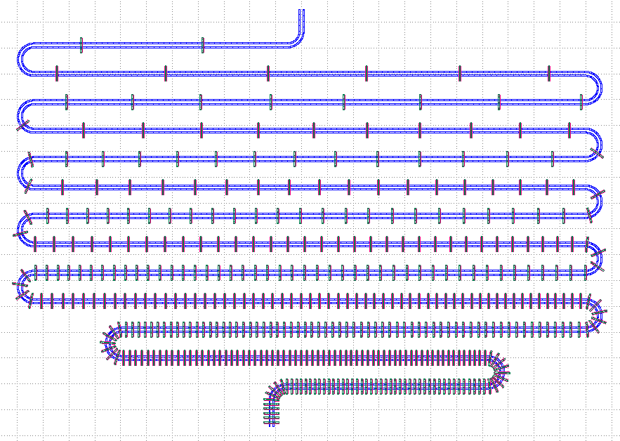
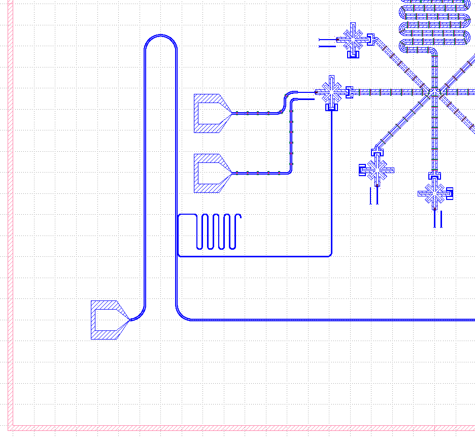

# demo

## 密度均匀变化的airbridge

``` python
def airbridgeDistance(distance,first=500000,second=470000,staticList=[0,0,0]):
    # staticList 第一个是上一个airbridge的距离,第二个是当前是第几个点,第三个是下一次的间隔
    # 这里利用了默认参数只初始化一次
    # 效果 : 1/length(i) 是等差数列
    if (distance<staticList[0]):
        staticList[0]=0
        staticList[1]=0
        staticList[2]=0
    if (staticList[2]==0):
        staticList[2]=first
    dd=distance-staticList[0]
    if(dd>staticList[2]):
        staticList[0]+=staticList[2]
        staticList[1]+=1
        staticList[2]=1/(1/first+staticList[1]*(1/second-1/first))
    return staticList[1]

def path(painter):
    ...

painter1=paintlib.CavityPainter(...)
length=painter1.Run(path)

# 定义 cell layer
...

painter1.Draw(cell3,layer1)#把画好的腔置入

painter2=paintlib.TransfilePainter("[Airbridge].gds","insert")
painter2.airbridgedistance=airbridgeDistance
painter2.DrawAirbridge(cell2,painter1.Getcenterlineinfo(),"Airbridge")

paintlib.IO.Show()
```



## 辐射状状排布的14bit



- - -

- [Start Page](README.md)  
- [脚本绘图基础](base.md)  
- **demo**  