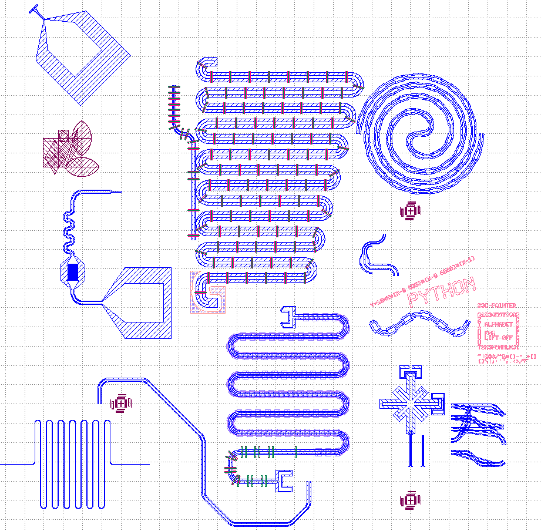

# demo

## 功能展示



[demos/featureList.py](files/?../../demos/featureList.py ':ignore')

## 密度均匀变化的airbridge

``` python
def airbridgeDistance(distance,first=500000,second=470000,staticList=[0,0,0]):
    # staticList 第一个是上一个airbridge的距离,第二个是当前是第几个点,第三个是下一次的间隔
    # 这里利用了默认参数只初始化一次
    # 效果 : 1/length(i) 是等差数列
    if (distance<staticList[0]):
        staticList[0]=0
        staticList[1]=0
        staticList[2]=0
    if (staticList[2]==0):
        staticList[2]=first
    dd=distance-staticList[0]
    if(dd>staticList[2]):
        staticList[0]+=staticList[2]
        staticList[1]+=1
        staticList[2]=1/(1/first+staticList[1]*(1/second-1/first))
    return staticList[1]

def path(painter):
    ...

painter1=paintlib.CavityPainter(...)
length=painter1.Run(path)

# 定义 cell layer
...

painter1.Draw(cell3,layer1)#把画好的腔置入

painter2=paintlib.TransfilePainter("[Airbridge].gds")
painter2.airbridgedistance=airbridgeDistance
painter2.DrawAirbridge(cell2,painter1.Getcenterlineinfo(),"Airbridge")

paintlib.IO.Show()
```


## 辐射状状排布的14bit


## 超出中心线绘制全包裹的airbridge

``` python
import paintlib
layout, top = paintlib.IO.Start("guinew")
layout.dbu = 0.001 
paintlib.IO.pointdistance = 1000 
TBD = paintlib.TBD.init(676987)
layer = layout.layer(10, 10)  
layer1 = layout.layer(10, 3)  
layer2 = layout.layer(10, 2)  
cell = layout.create_cell("Cavity1")  
top.insert(pya.CellInstArray(cell.cell_index(), pya.Trans()))

path='n5[r50000 s50000 l50000]' # 此为原始的腔
p1='s300000' # 通过在两侧增加额外的路径来实现超出的部分
p2='s300000'
a=paintlib.CavityPainter(pya.DPoint(0, 24000), angle=90, widout=16000, widin=8000) # 用来画原始的腔
b=paintlib.CavityPainter(a.brush.reversed()) # 用来生成拓展了p1 p2的中心线
a.Run(path)
a.Draw(cell,layer) # 正常画原来的腔
b.Run(paintlib.TraceRunner.reversePath(p1)) # 将b逆着p1运动到拓展的腔的真正的起点
b=paintlib.CavityPainter(b.brush.reversed())
b.cavityLength=b.Run(p1+path+p2) # 生成拓展的中心线
centerlineinfo=b.Getcenterlineinfo()
paintlib.SpecialPainter.DrawContinueAirbridgePainter(
    cell, layer1, layer2, centerlineinfo, s1=70000, s2=70000+85000, e1=b.cavityLength-15000, e2=b.cavityLength-15000-8500,rounded=1000)
```

- - -

- [Start Page](README.md)  
- [脚本绘图基础](base.md)  
- **demo**  