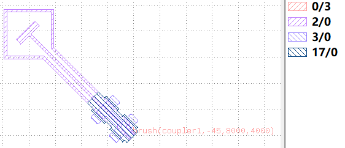
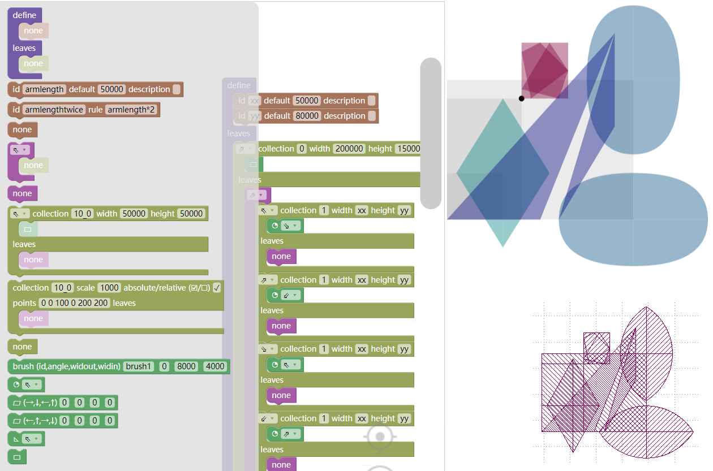
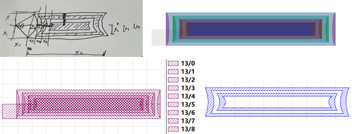
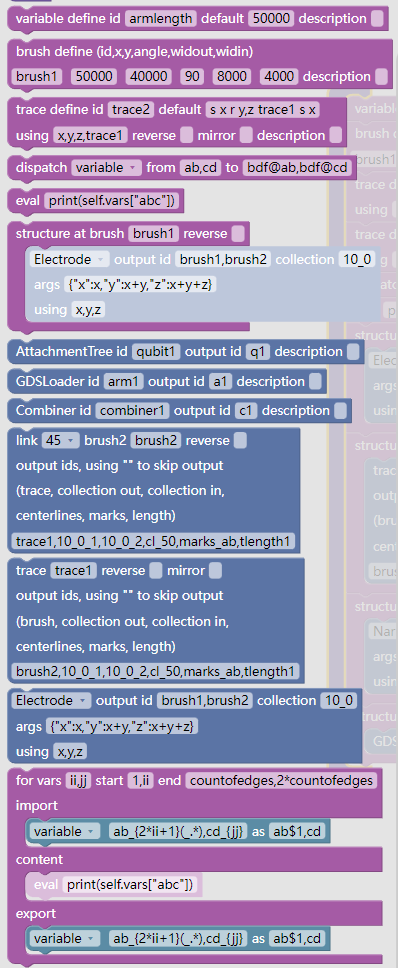
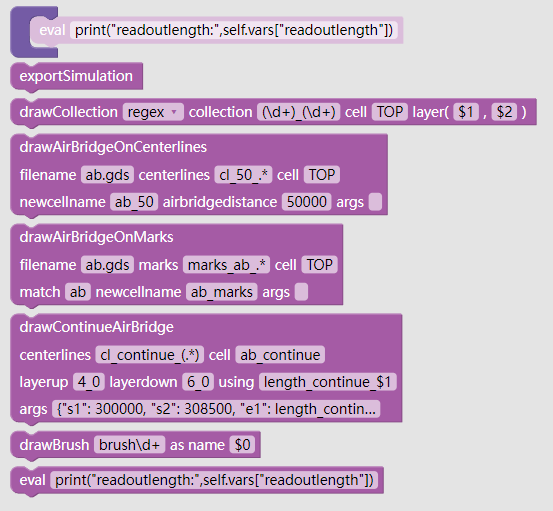

# 绘制库的建立和使用

## 绘制库

用标准的形式来绘制具有特定功能的图形模组

**paintlib** 中提供了如下的类, 通过json描述绘制过程:
+ Component : 绘图库的基类
+ GDSLoader : 通过gds文件来导入元件
+ AttachmentTree : 通过描述一些基础图形的碰撞盒的粘附关系, 以附着树的形式来描述元件
+ Combiner : 放置元件并通过轨迹来连接笔刷
+ GridLayout : 以网格的形式放置组合器
+ ComponentPainter : 组合绘制region和空桥等

## 图形界面

仓库 [AttachmentTree](https://github.com/SQCEDA/AttachmentTree) 中提供了图形化的json编辑器

[AttachmentTree](https://sqceda.github.io/AttachmentTree/AttachmentTree/demo.html)

[Combiner](https://sqceda.github.io/AttachmentTree/Combiner/demo.html)

[ComponentPainter](https://sqceda.github.io/AttachmentTree/ComponentPainter/demo.html)

这些图形界面通过拖拽图块产生json, 部分配有实时预览

## Component

GDSLoader,AttachmentTree,Combiner,ComponentPainter的基类

数据部分包含7个dict来分别储存相应数据
+ collection : region
+ brush : 笔刷
+ vars : 数值
+ trace : 轨迹(字符串)
+ structure : 子结构(Component类以及子类)
+ centerlines : 轨迹的中心线
+ marks : 轨迹的标记

+ 方法`update(vars={"a":1}, trace={"t1":"s 50000"})` 更新数据, 可以同时使用多个数据.
+ 方法`update(anotherComponent)` 从另一个Component更新其所有数据.
+ 方法`transform(tr)` 执行转换, 目前不会对子结构执行转换, 只对自己拥有的所有内容各执行一次. 要避免一个图形被同一个Component拥有多个引用, 会导致被执行多次转换, 进而发生位置角度的错误.

## GDSLoader

对于部分固定的且已存在的图形, 可以把gds文件直接作为元件库使用. 可以在其中通过gds标准中的Text来指定笔刷



如图所示的gds加载后会得到一个collection在`0_3` `2_0` `3_0` `17_0`下有region, brush在`couper1`下有个-45度笔刷的对象

`paintlib.GDSLoader().load(filename)`

`paintlib.GDSLoader().attachAtBrush(filename,brush)` 等效于先`load`再执行转换`tr=brush.DCplxTrans`

## AttachmentTree



为了改进通过参数直接计算坐标的效率, 以及实现标准化, 提供一种设计组件的机制

把基础图形放置在一个紧贴着的矩形中, 称为碰撞盒.  
每个碰撞盒再提供四个角作为附着点, 每个附着点的四个方向可以继续放置碰撞盒, 内部嵌入基础图形.  
用这样的树结构来描述图形间的位置关系.

如图所示提供了树根图块, 变量定义图块, 方向指定图块, 碰撞盒放置图块, 坐标导入图块, 以及各种基础图形的图块

### 变量定义图块

默认值可以直接使用其他变量来计算, 例如填`xx*2**0.5`  
在执行语句时如果该id的变量已经存在则不再计算.  
借此来实现传入的值覆盖默认值.  
使用其他变量来计算的场合, 该变量是传入的值时, 使用的是传入的值.  

### 方向指定图块

箭头对应取上一个碰撞盒的相应的角落

### 碰撞盒放置图块

箭头对应放在附着点的哪个方向  
内部放置一个基础图形图块

### 坐标导入图块

用从已存在的图形直接提取坐标  
使用绝对坐标时指定的是相对与附着点的偏移  
使用相对坐标时指定的是相对与上一个点的偏移  

### 基础图形图块

提供了
+ 笔刷
+ 半弧, 弧顶与长边相切, 圆心在箭头指向的方向
+ 四边形, 分别指定上右下左的点距离其逆时针方向的碰撞盒的顶点的距离
+ 四边形, 分别指定上右下左的点距离其顺时针方向的碰撞盒的顶点的距离
+ 直角三角形, 直角边在箭头指向的方向
+ 矩形

### 构图流程



以一个比较复杂的结构来讲解流程,  
首先需要想清楚需要的结构的样子, 可以画在演草纸上  
分解成基础结构, 一般来说用减法的构造比每个局部一片片加简单  
把所有参数列出来  
把图形拼出来  
最后计算参数的依赖关系  

### 构造脚本

使用文件名或者python字典对象均可, 直接粘贴作为对象使用时, 要注意先定义`true=True`和`false=False`来兼容json的写法

`component=paintlib.AttachmentTree().load('AttachmentTreeDemo.json',{'yy':90000}).transform(pya.DCplxTrans(1,0,False,-904000,728000))`  

`component=paintlib.AttachmentTree().attachAtBrush('AttachmentTreeDemo.json',brush1,{'yy':90000})`  

绘制的部分在ComponentPainter

## Combiner



通过组件+笔刷+轨迹的方式来组合出器件层级的图形. 例如量子比特, 读取腔等等.  
借助笔刷的角度能够实现AttachmentTree中做不到的旋转的结构.  

### 定义图块

变量定义和笔刷定义类似AttachmentTree, 其中可以使用变量来计算.

路径定义图块中可以使用变量, 但是不做计算, 且要把用到的变量都填在using中

### 派发图块

用来把变量或图形等发送到子结构中或者取回

以及可以进行路径长度的计算

使用了逗号的场合, 成组的进行派发操作. 不使用逗号的场合, 把`from`域中
的内容视为正则表达式, 对`to`域中的内容进行渲染, 把形如`$0`,`$1`的内容替换成正则表达式的分组

例如`collection.merge` `abc@.*` `$0`就是把子结构abc中的所有collection合并到当前结构的同名的collection里

对于子结构, 只会把`@`后面的内容视为正则表达式, 不会对子结构的名字进行匹配

名字带`merge`的是合并, 不带的是替换

### 子结构图块

在指定笔刷(或者其转向180度后的笔刷)处放置一个内容

可以指定metal中的id给出新子结构的id来放置`GDSLoader`,`AttachmentTree`,`Combiner`  
这种情况下, 通过在放置子结构前, 就向这个id派发变量来实现参数的传递

以及通过给定参数来放置`Electrode`,`Connection`,`Narrow`,`InterdigitedCapacitor`

或者放置`笔刷连接图块`和`路径运动图块`

### 笔刷连接图块

连接两个笔刷, 可选按照45度或直接连接

此处的连接是不考虑的障碍的确定性的连接

相应的输出可以空着代表不储存

### 路径运动图块

从笔刷出发沿着指定路径运动

相应的输出可以空着代表不储存

### 循环图块

循环变量最多两个, 会同时包含首和末

每组循环会创建一个新的子结构, 通过类似派发图块的图块完成导入导出, 内部放置子结构的图块

导入导出图块会先把`{}`的内容按照fstring来计算, 之后效果同原始的派发图块

### 构造脚本

使用文件名或者python字典对象均可, 直接粘贴作为对象使用时, 要注意先定义`true=True`和`false=False`来兼容json的写法

metal按照字典传入自结构的输入

`combiner=paintlib.Combiner().load('CombinerDemo.json',{'sub1':'sub1.gds','sub2':'AttachmentTreeDemo.json'},{'zz':90000})`  

`component=paintlib.Combiner().attachAtBrush('AttachmentTreeDemo.json',brush1,{'sub1':'sub1.gds'},{'zz':90000})`  

绘制的部分在ComponentPainter

## GridLayout

通过网格的形式布局Combiner到各个位置, 自身也作为Combiner的子类

```py
gridStr='''
        p   q   p   q   p
      m a 1 b 2 a 1 b 2 a n
        3   4   3   4   3
      n b 2 a 1 b 2 a 1 a m
        4   3   4   3   3
      m a 1 b 2 a 1 b 2 a n
        3   4   3   4   3
      n b 2 a 1 b 2 a 1 a m
        4   3   4   3   3
      m a 1 b 2 a 1 b 2 a n
        q   p   q   p   q
'''
```

每个单长度的字符作为一种类别, 某行或某列全空白时忽略, 使用`#`作为行注释

指定每种类型的尺寸和使用的metal中的id

```py
types={
    'a':{"width":l1,"height":l1,"id":"typea"},
    'b':{"width":l1,"height":l1,"id":"typea"},

    '1':{"width":l2,"height":l1,"id":"type1"},
    '2':{"width":l2,"height":l1,"id":"type2"},
    '3':{"width":l1,"height":l2,"id":"type3"},
    '4':{"width":l1,"height":l2,"id":"type4"},

    'm':{"width":l2,"height":l1,"id":"type2"},
    'n':{"width":l2,"height":l1,"id":"type1"},
    'p':{"width":l1,"height":l2,"id":"type4"},
    'q':{"width":l1,"height":l2,"id":"type3"},
}
```

以及描述数据的流动, 每个选项必须包含`condition`, 内部可以基于行列索引和类别来传递变量和导出数据, 导出数据的写法类似派发语句

```py
config=[
    {
        "condition":"1",
        "export":[["collection.merge","0,1","0_0,10_0"]],
    },
    {
        "condition":"'{mark}'=='a'",
        "vars":{"arg1":80000}
    },
    {
        "condition":"'{mark}'=='b'",
        "vars":{"arg1":60000}
    },
    {
        "condition":"{xindex}==1 and {yindex}>=5",
        "vars":{"arg3":25000}
    },
]
```

### 构造脚本

`grid1=paintlib.GridLayout(gridStr,types,config).load({"type": "combiner","statement": []},metal)`

其`load`函数和`attachAtBrush`同Combiner, 会额外先赋值`width`,`height`再执行原来Combiner对应函数的内容

网格中内容作为Combiner, 会额外先赋值`width`,`height`,`mark`,`xindex`,`yindex`后再执行`load`和`transform`, 会被以`Grid_{xindex}_{yindex}_{mark}`的形式命名为子结构, 可以通过修改`GridLayout.GridNameTemplate`来更改, 不过在正常的使用过程中, `config`的`export`已经可以完成所有操作了, 不需要再额外去直接访问这些子结构

网格全部执行完毕后才会执行本体的语句

## ComponentPainter



实际执行绘制到gds中的类

### 区域图块

`regex`设置下会用正则表达式匹配所有区域名, 计算出使用的cell和layer直接放置.  
例如`(\w+)_(\d+)_(\d+)` cell `$1` layer(`$2`,`$3`)

`operation`设置下进行运算, 例如  
`(10_0_1 - 10_0_2) & 10_0_0`

### 沿中心线空桥图块

沿着中心线按照间距插入gds文件

### 沿标记空桥图块

沿着内容需要符合给定的正则表达式的标记插入gds文件

### 连续空桥图块

沿着中心线布连续空桥, 参数同`SpecialPainter.DrawContinueAirbridgePainter`, 中间用到的变量需放到`using`中

### 笔刷图块

把正则表达式匹配的所有笔刷用给定的id放到图中

### 构造脚本

```py
painter=paintlib.ComponentPainter().update(component).Draw({
    "type": "componentPainter",
    "statement": [
        {
            "type": "drawCollection",
            "op": "regex",
            "collection": "(\\d+)_(\\d+)",
            "cell": "TOP",
            "l1": "$1",
            "l2": "$2"
        }
    ]
})
```

要注意使用cell前要保证该名字的cell已经存在了


## 规范

### 变量名

变量id长度至少是2位, 例如使用`ii`而不是`i`, (目前的版本不会去解析长度1的id, 和路径的关键字容易冲突)

除非明确代表以下含义, 否则变量名不要使用这些  
+ mark: 网格的类型
+ xindex: 网格的列数
+ yindex: 网格的行数
+ widthin: 附着的笔刷的内宽度
+ widthout: 附着的笔刷的外宽度
+ width: 网格的宽度
+ height: 网格的高度

变量名用代表其实际含义的无空格的单词拼起来, 连接处将第二词首字母大写, 形如`armLength`

具有相似含义的变量名用词加递增的数字`arm1,arm2,...`

### 区域

collection需要放置的某层的图形直接使用形如`10_0`, 或者`cellname_10_0`

需要做运算的使用形如`10_0_1`,`10_0_2`等(或者最前面再加上`cellname_`), 后缀`_1`放正的图形, `_2`放要减去的图形, `_0`放辅助图形, 在往后的暂不做约定

### 中心线

准备按照50微米放空桥的线命名为类似`ab_50`, 前缀可以体现需要放的桥的宽度, 后缀体现间隔距离

准备放连续空桥的命名包含`continue`

### 腔的长度

把腔的完整长度算出来放置到变量中

- - -

- [Start Page](README.md)  
- [脚本绘图基础](base.md)  
- **绘制库的建立和使用**  
- [demo](demo.md)  