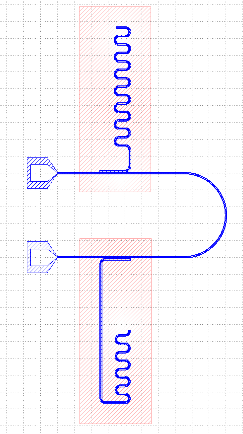

# simulation

## sonnet微波仿真

生成matlab文件, 通过 [SonnetLab_v7.4](http://www.sonnetsoftware.com/support/sonnet-suites/sonnetlab.html) 调用 [sonnet v14.52](http://www.sonnetsoftware.com/) 实现微波仿真.

需要将 SonnetLab_v7.4/Scripts/SonnetPath.m 的117行 `aWasteCharacter=aRegistryFileLine(4);`  
改为 `aWasteCharacter=aRegistryFileLine(5);` 才能正常工作.

通过修改matlab模板文件 [matlabtpl.m](files/?../../simulation-matlab/matlabtpl.m ':ignore') 来修改sonnet的相关设置, 默认设置为`500μm Sapphire 2000μm Air 图形层Al 0.1μm, cellsize 1μm × 1μm`.

matlab模板文件的部分内容以及Q值拟合脚本由 [@Rui](https://github.com/richardvancouver) 提供.


## usage

导入`paintlib`后额外导入`simulation`
```python
from simulation import Simulation
```

画图完成后调用`Simulation.create`创建.m文件

<pre v-pre="" data-lang="python"><code class="lang-python"># 欲仿真的腔
painter5=paintlib.CavityPainter(brush5)
...

# 控制线
painter4=paintlib.CavityPainter(brush4)
...
c4=painter4.Getcenterlineinfo()

Simulation.create(
    <span style="font-weight: bold;color:navy">name</span>='sonnetProjectName',
    <span style="font-weight: bold;color:navy">startfrequency</span>=4,<span style="font-weight: bold;color:navy">endfrequency</span>=8,<span style="font-weight: bold;color:navy">freqnum</span>=2,
    <span style="font-weight: bold;color:navy">layerlist</span>=[(10,10)],<span style="font-weight: bold;color:navy">boxx</span>=500000,<span style="font-weight: bold;color:navy">boxy</span>=500000,
    <span style="font-weight: bold;color:navy">region</span>=painter5.region,<span style="font-weight: bold;color:navy">brush</span>=painter5.brush,
    transmissionlines=[c4],portbrushs=None,
    porttype=None,parametertype='S',speed=0,
    offsetx=0,offsety=0,deltaangle=15,
    absx=None,absy=None,
    extra=None
    )
</code></pre>

完整例子见[demos/simulationDemo.py](files/?../../demos/simulationDemo.py ':ignore')

参数含义(带`*`为必填):
+ `name*`: 切割的cell的名字以及.m文件和sonnet项目名字.
+ `startfrequency* endfrequency*`: 起止频率, 以GHZ为单位.
+ `freqnum*`: 频率点的数量.
+ `layerlist*`: 切割取反的layer列表.
+ `boxx* boxy*`: 切割盒子的宽高.
+ `region*`: 用于自动识别切割中心点的区域, 可以填None, 此时`absx absy`必须为数字.
+ `brush*`: 用于向两端发射线产生传输线和端口的笔刷, 可以填None.
+ `transmissionlines`: 传输线的中心线列表, 用于产生端口.
+ `portbrushs`: 通过笔刷列表直接指定端口.
+ `porttype`: 形如`[0,1]`, 依次指定所有端口类型, 是Standard还是Co-calibrate.
+ `parametertype`: `'S'或'Y'或'Z'`,指定输出文件的参数类型.
+ `speed`: `0或1或2`数字越大仿真越快.
+ `offsetx offsety`: 指定切割区域的偏移.
+ `deltaangle`: 指定切割区域的逆时针旋转角度.
+ `absx absy`: 直接通过坐标指定切割区域的中心点, 此时不再通过`region`定位, `region`可以填None.
+ `extra`: 额外传递给matlab的变量(通过json实现, 要注意matlab的一个元素的数组和数是无区分的)

同时由多种方式指定端口时, 顺序为`brush`->`transmissionlines`->`portbrushs`.

## matlab模板文件

section 2

`Project.changeCellSizeUsingNumberOfCells(1,1);`  
设置仿真的cell size 1μm × 1μm

section 3

调用fixFormat.py来设置材料, 其中

`MET "Al" 1 NOR INF 0 0.1 `  
设置AL的厚度0.1μm

`      2000 1 1 0 0 0 0 "Air"`  
设置Air的厚度2000μm

`      500 9.3 1 3e-006 0 0 0 "Sapphire" A 11.5 1 3e-006 0 0 `  
设置Sapphire的厚度500μm

section 5

数据处理  
默认的代码段作用是画出S11和S21曲线  
可以改为如下代码来自动拟合S21曲线得到Q值  
其中用到的qfit1, [点此下载](files/QFitScripts.zip ':ignore')相关文件, 放在生成的代码同目录  
```matlab
snpfilename_=[project_name_,'.s',num2str(portnum_),'p'];
S21 = TouchstoneParser(snpfilename_,2,1);
[c,dc] = qfit1(S21)
save(  strcat(project_name_,'.mat'),'c','dc' )
```

## 自动化确定设计参数

利用`设计-调整参数-仿真-调整参数-仿真-...`的链路来自动得到设计参数

提供了如图所示的腔频设计环路作为示例 [点此下载](files/AutoCircle.zip ':ignore')



另外提供某不愿透露姓名的作者使用的**不依赖klayout**的, 只用来打开gds文件并设置端口仿真的程序[gdstoson.m](files/?gdstoson.m ':ignore'), 此程序使用了库 [Octave / MATLAB Toolbox for GDSII Stream Format](https://github.com/ulfgri/gdsii-toolbox) 来读gds, 仿真依然是使用了SonnetLab

使用sqc-painter做同样的事的话, 可以利用`painter=paintlib.TransfilePainter(filename="[insert].gds")` `painter.DrawGds(cell,newcellname,tr:pya.DCplxTrans)`来导入完整的gds, 不画图并直接`Simulation.create(...)`