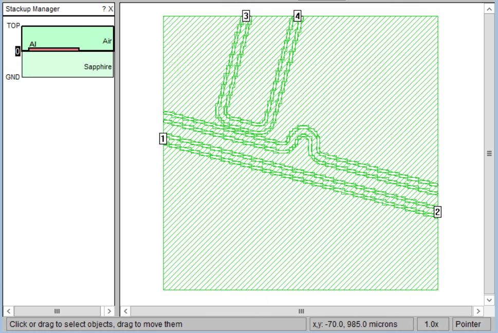

# simulation

## sonnet微波仿真

生成matlab文件, 通过 [SonnetLab_v7.4](http://www.sonnetsoftware.com/support/sonnet-suites/sonnetlab.html) 调用 [sonnet](http://www.sonnetsoftware.com/) 实现微波仿真.

需要将 SonnetLab_v7.4/Scripts/SonnetPath.m 的117行 `aWasteCharacter=aRegistryFileLine(4);`  
改为 `aWasteCharacter=aRegistryFileLine(5);` 才能正常工作.

通过修改matlab模板文件 [matlabtpl.m](https://github.com/zhaouv/sqc-painter/blob/master/matlabtpl.m) 来修改sonnet的相关设置, 默认设置为`500μm Sapphire 2000μm Air 图形层Al, cellsize 1μm × 1μm`.

matlab模板文件由 [@Rui](https://github.com/richardvancouver) 提供.



## usage

导入`paintlib`后额外导入`simulation`
```python
from simulation import Simulation
```

画图完成后调用`Simulation.create`创建.m文件
```
# 欲仿真的腔
painter5=paintlib.CavityPainter(brush5)
...

# 控制线
painter4=paintlib.CavityPainter(brush4)
...
c4=painter4.Getcenterlineinfo()

Simulation.create(
    name='sonnetProjectName',
    startfrequency=4,endfrequency=8,stepfrequency=4,
    layerlist=[(10,10)],boxx=500000,boxy=500000,
    region=painter5.region,brush=painter5.brush,
    transmissionlines=[c4],portbrushs=None,
    offsetx=0,offsety=0,deltaangle=15,
    absx=None,absy=None
    )
```

完整例子见[demos/simulationDemo.py](https://github.com/zhaouv/sqc-painter/blob/master/demos/simulationDemo.py)

参数含义(带`*`为必填):
+ `name*`: 切割的cell的名字以及.m文件和sonnet项目名字.
+ `...frequency*`: 起止频率和间隔频率, 以GHZ为单位.
+ `layerlist*`: 切割取反的layer列表.
+ `boxx* boxy*`: 切割盒子的宽高.
+ `region*`: 用于自动识别切割中心点的区域, 可以填None, 此时`absx absy`必须为数字.
+ `brush*`: 用于向两端发射线产生传输线和端口的笔刷, 可以填None.
+ `transmissionlines`: 传输线的中心线列表, 用于产生端口.
+ `portbrushs`: 通过笔刷列表直接指定端口.
+ `offsetx offsety`: 指定切割区域的偏移.
+ `deltaangle`: 指定切割区域的逆时针旋转角度.
+ `absx absy`: 直接通过坐标指定切割区域的中心点, 此时不再通过`region`定位, `region`可以填None.

同时由多种方式指定端口时, 顺序为`brush`->`transmissionlines`->`portbrushs`.